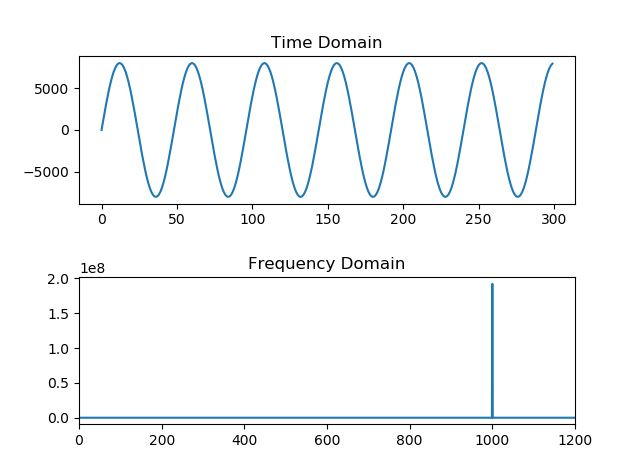

# Python For Engineers
[Python For Engineers](https://www.pythonforengineers.com/) is a free online book that offers a good introduction to using Python for more scientific applications such as data analysis/visualization, computer vision, and machine learning. This repository is for replicating the projects in the book and adding my own explanatory comments for a more formal education on the topics covered.

  
  <i>Computer Vision: Facial Detection</i>

  
  <i>Signal Processing: Fourier Transform</i>

